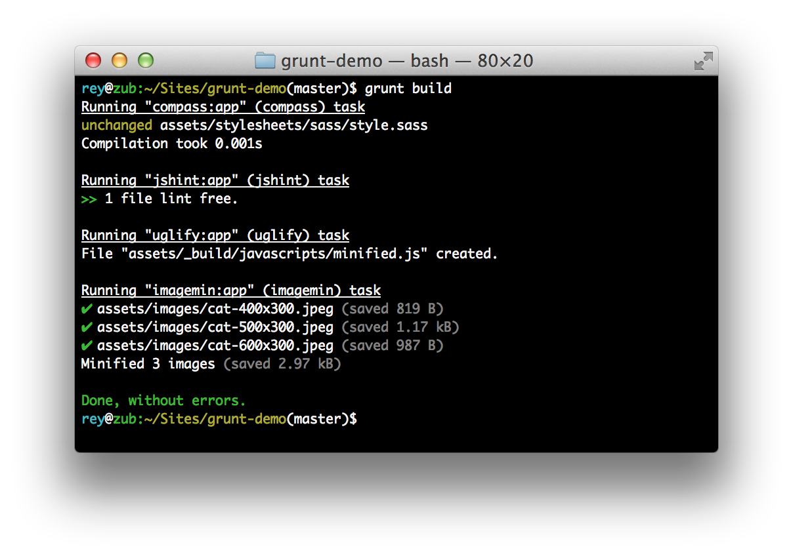

grunt-demo
==========

## About

This is a proof of concept of how I could use Grunt to make front end development super efficient.

### Plugins

There's so many Grunt plugins that I've limited myself to 5 which I think account for the majority of the work I find myself doing. These are:

* [grunt-contrib-compass](https://github.com/gruntjs/grunt-contrib-compass) does all the compass wizardry
* [grunt-contrib-watch](https://github.com/gruntjs/grunt-contrib-watch) runs asks when watched files/directories are changed
* [grunt-contrib-jshint](https://github.com/gruntjs/grunt-contrib-jshint) validates files with jshint
* [grunt-contrib-uglify](https://github.com/gruntjs/grunt-contrib-uglify) minifies js with uglifyjs
* [grunt-contrib-imagemin](https://github.com/gruntjs/grunt-contrib-imagemin) minifies png, gif and jpg images

### Tasks

There are currently 2 tasks: `grunt dev` and `grunt build`.

* `grunt dev` fires up the `watch` task which keeps an eye on your Sass (`compass`) and JS (`jshint`) whilst you're bashing out code.
* `grunt build` runs all of the above and sticks them in the `assets/_build` folder ready to be deployed.

## Dependencies

* `ruby 2.0.0p247` or any flavour of Ruby 2 would be fine, I suspect

## Installation

### Install [Node](http://nodejs.org)

On OS X using Homebrew:

`brew install node`

### Install [Grunt](http://gruntjs.com)

`npm install -g grunt-cli`

### Install Sass, Compass

`bundle`

## Running Grunt

Run the default grunt task (currently `dev`) by

`grunt`

### Run specific Grunt tasks by

`grunt dev`, `grunt build`, etc
